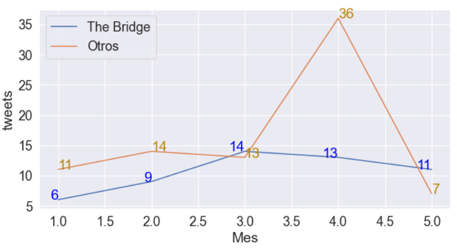

# Detección de Emociones tweets @TheBridge_Tech

Prueba técnica llevada a cabo al final del bootcamp Data Science. Se requería recopilar los tweets de la escuela The Bridge | Digital Talent Accelerator (@TheBridge_Tech) desde principios del año 2022 hasta el 22 de mayo.

Con la librería snscrape pude obtener todos los tweets en los que se menciona The Bridge; con ellos se llevó a cabo un EDA, a continuación, se puede observar el número de tweets por mes, tanto los que publica The bridge como otros usuarios; siendo abril el mes donde más tweets hay por parte de los usuarios.

Por otro lado, para detectar la emoción de los Tweets, primero hubo una transformación de estos, removiendo todos los emoticones, signos, stopwords, y posteriormente realizar un stemmer y vectorizar con CountVectorizer, todo lo mencionado anteriormente se llevó a cabo con la librería NLTK.

Por último, con ayuda de la librería Flask fue posible desplegar el modelo remotamente.
